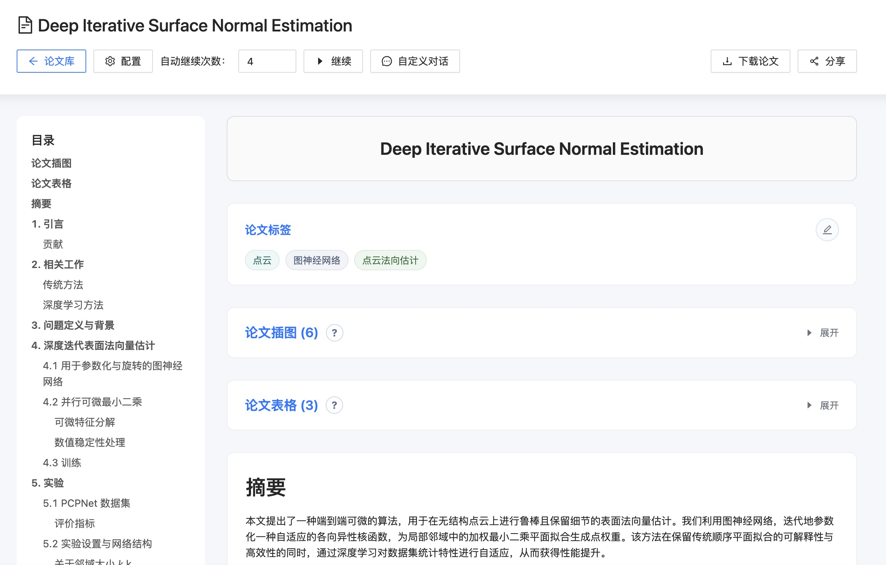

# PDF 论文翻译助手



一个基于 FastAPI + Poe AI 的 PDF 论文翻译服务，支持逐章翻译、会话管理和断点续翻。

## 功能特性

- 📄 **PDF 上传与翻译**：上传 PDF 文件，自动调用 GPT-5.2-Instant 进行翻译
- 🔄 **断点续翻**：支持分章节翻译，可随时继续翻译下一章节
- 💾 **会话管理**：自动保存所有翻译历史，支持查看完整会话记录
- 🏷️ **标题自动提取**：从 PDF 首页自动提取论文标题
- 📋 **结构化输出**：按摘要和章节组织翻译内容，使用 Markdown 格式
- 🗄️ **数据持久化**：使用 SQLite 数据库存储会话、消息和文件记录

## 技术栈

- **后端框架**：FastAPI
- **数据库**：SQLite + SQLModel
- **AI 服务**：Poe API (GPT-5.2-Instant)
- **PDF 处理**：PyMuPDF (fitz)
- **前端**：静态HTML页面

## 部署指南

### 前置要求

- Python 3.9+
- pip 或 conda

### 安装依赖

```bash
pip install fastapi uvicorn sqlmodel pymupdf fastapi-poe python-multipart gunicorn
```

### 环境配置

1. 获取 Poe API Key：
   - 访问 [Poe官网](https://poe.com/)
   - 创建账户并获取 API Key

2. 本地目录结构确认：
   ```
   translate/
   ├── app.py
   ├── static/
   │   └── index.html
   ├── uploads/           # 自动创建
   └── translations.db    # 自动创建
   ```

### 启动服务

```bash
uvicorn app:app --reload
```

服务将在 `http://127.0.0.1:8000` 启动

如果需要部署，建议使用 `gunicorn`，并配置反向代理。

```bash
gunicorn -k uvicorn.workers.UvicornWorker app:app -w 4 -b 127.0.0.1:8000
```

## 使用方法

### 通过 Web 界面

1. 打开浏览器访问 `http://127.0.0.1:8000`
2. 上传 PDF 文件并输入 Poe API Key
3. 等待 AI 翻译摘要
4. 点击"继续"按钮翻译下一章节
5. 查看翻译历史记录

### 通过 API 调用

#### 1. 上传 PDF 并开始翻译

```bash
curl -X POST "http://127.0.0.1:8000/upload" \
  -F "file=@paper.pdf" \
  -F "api_key=your_poe_api_key"
```

**响应示例：**
```json
{
  "conversation_id": "abc123def456",
  "reply": "# 摘要\n\n论文主要介绍..."
}
```

#### 2. 继续翻译下一章节

```bash
curl -X POST "http://127.0.0.1:8000/continue/abc123def456" \
  -F "api_key=your_poe_api_key"
```

**响应示例：**
```json
{
  "reply": "# 第一章\n\n研究背景..."
}
```

#### 3. 获取完整会话

```bash
curl "http://127.0.0.1:8000/conversation/abc123def456"
```

**响应示例：**
```json
{
  "id": "abc123def456",
  "title": "Deep Learning Fundamentals",
  "created_at": "2026-02-24T10:30:00",
  "messages": [
    {
      "role": "user",
      "content": "翻译这篇论文..."
    },
    {
      "role": "bot",
      "content": "# 摘要\n\n..."
    }
  ]
}
```

#### 4. 获取所有会话列表

```bash
curl "http://127.0.0.1:8000/conversations"
```

**响应示例：**
```json
[
  {
    "id": "abc123def456",
    "title": "Deep Learning Fundamentals",
    "created_at": "2026-02-24T10:30:00"
  },
  {
    "id": "xyz789uvw012",
    "title": "Machine Learning Basics",
    "created_at": "2026-02-23T15:45:00"
  }
]
```

## API 端点说明

| 方法 | 端点 | 说明 |
|------|------|------|
| POST | `/upload` | 上传 PDF 文件并开始翻译 |
| POST | `/continue/{conversation_id}` | 继续翻译下一章节 |
| GET | `/conversation/{conversation_id}` | 获取完整会话内容 |
| GET | `/conversations` | 获取所有会话列表 |
| GET | `/` | 主页面 (Web 界面) |
| GET | `/chat/{conversation_id}` | 查看指定会话 (Web 界面) |

## 数据存储

### 数据库表结构

- **Conversation**：会话记录（ID、标题、文件名、状态、创建时间）
- **Message**：消息记录（ID、会话ID、角色、内容、创建时间）
- **FileRecord**：文件记录（ID、会话ID、文件路径、Poe CDN 信息）

### 文件位置

- **PDF 文件**：`uploads/{file_id}.pdf`
- **数据库**：`translations.db`

## 工作流程

```
1. 用户上传 PDF
   ↓
2. 系统保存本地副本
   ↓
3. 上传到 Poe CDN（获得可复用 URL）
   ↓
4. 发送初始翻译请求（包含 PDF attachment）
   ↓
5. 保存会话和第一段回复
   ↓
6. 用户点击"继续"
   ↓
7. 重用 Poe CDN URL，无需重新上传文件
   ↓
8. 继续翻译，保存新消息
   ↓
9. 重复 6-8 直到完成
```

## 常见问题

**Q: API Key 在哪里获取？**
A: 访问 [Poe官网](https://poe.com/) 注册账户，在设置中获取 API Key。

**Q: 如何修改翻译提示词？**
A: 编辑 `app.py` 中 `/upload` 端点的 `initial_prompt` 变量即可。

**Q: 可以使用其他 Poe 模型吗？**
A: 可以。修改 `fp.get_bot_response()` 中的 `bot_name` 参数，改为其他可用的模型名称。

