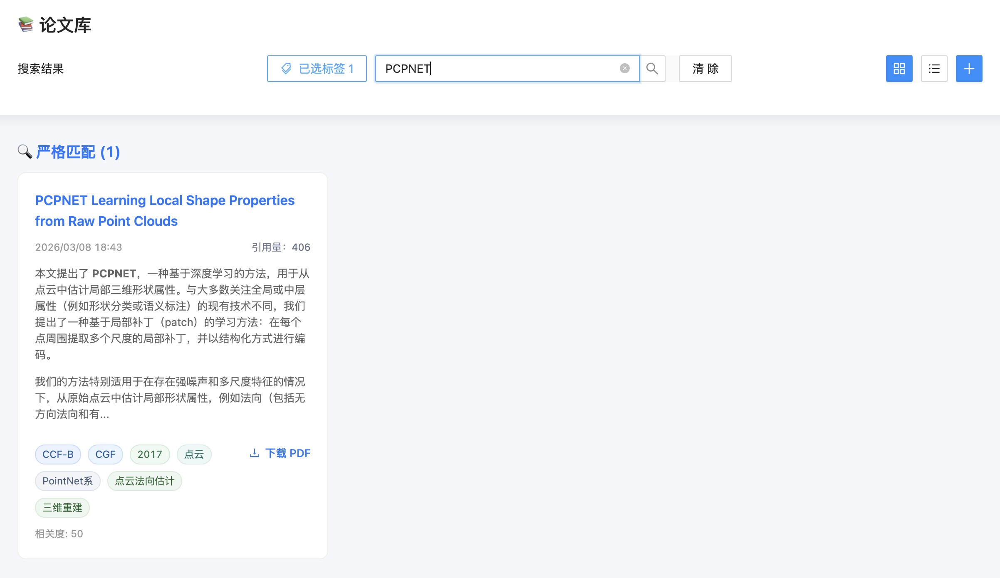
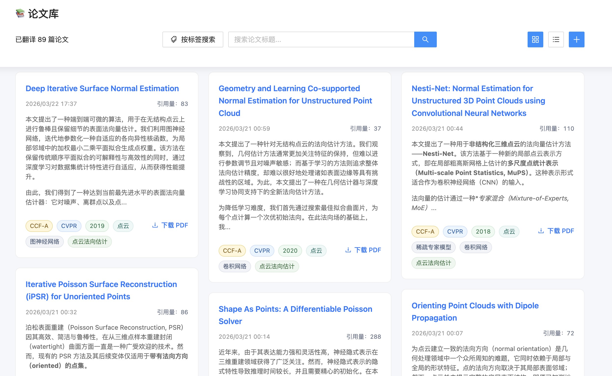
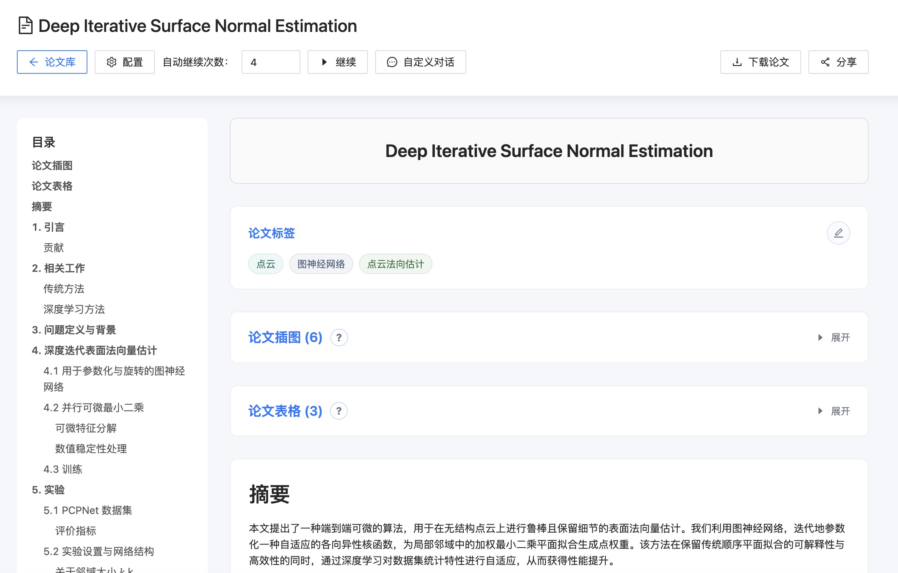

# PDF 论文翻译助手

一个基于 FastAPI + Poe API 的论文翻译服务，支持 PDF 上传、分章续翻、会话管理，以及标签/图表/语义检索信息的增量维护。

## Demo

[https://translate.icydev.cn](https://translate.icydev.cn)

## 页面预览





## 核心能力

- PDF 上传后自动创建翻译会话，并生成首轮翻译结果
- 支持“继续”续翻，按章节逐步推进
- 支持会话内自定义追问（可选择是否写入历史）
- 支持论文标签自动提取与手动改写
- 支持论文图片/表格提取并以二进制资产存储
- 支持标题搜索（精确 + 模糊）与标签/CCF/会议/年份过滤
- 支持只读模式（禁用写操作，仅浏览）

## 技术栈

- 后端：FastAPI
- 数据层：SQLModel + SQLAlchemy
- 数据库：SQLite（默认）/ PostgreSQL
- AI：fastapi-poe（Poe）
- PDF 与资产处理：pypdf + PyMuPDF + Pillow
- 前端：`static/index.html`（React + Ant Design CDN）

后端 Python 模块统一放在 `backend/`，根目录 `app.py` 仅作为启动兼容入口（`uvicorn app:app`）。

## 快速启动

### 1) 环境准备

- Python 3.10+
- pip

### 2) 安装依赖

```bash
pip install -r requirements.txt
```

### 3) 配置环境变量

```bash
cp .env.example .env
```

按需修改 `.env`：

| 变量 | 默认值 | 说明 |
| --- | --- | --- |
| `DATABASE_URL` | `sqlite:///translations.db` | 数据库连接串 |
| `POE_MODEL` | `GPT-5.2-Instant` | 后端默认模型（可被前端请求参数覆盖） |
| `TITLE_PROMPT` | 内置中文提示词 | 标题提取提示词 |
| `INITIAL_PROMPT` | 内置中文提示词 | 首轮翻译提示词 |
| `READ_ONLY` | `false` | 是否启用只读模式 |

### 4) 启动服务

```bash
uvicorn app:app --reload
```

打开 [http://127.0.0.1:8000](http://127.0.0.1:8000)。

## 生产部署示例

```bash
gunicorn -k uvicorn.workers.UvicornWorker app:app -w 4 -b 127.0.0.1:8000
```

## 接口概览

| 方法 | 路径 | 说明 |
| --- | --- | --- |
| `POST` | `/upload` | 上传 PDF 并创建会话 |
| `POST` | `/continue/{conversation_id}` | 对会话发送“继续” |
| `POST` | `/custom_message/{conversation_id}` | 自定义追问 |
| `GET` | `/conversation/{conversation_id}` | 获取会话详情 |
| `GET` | `/conversations` | 分页会话列表（支持过滤） |
| `GET` | `/search` | 标题搜索（精确 + 模糊） |
| `GET` | `/tags/library` | 标签树与使用计数 |
| `POST` | `/conversation/{conversation_id}/tags` | 手动更新标签 |
| `POST` | `/conversation/{conversation_id}/reprocess_assets` | 按 caption 方向重提图/表 |
| `GET` | `/assets/figures/{figure_id}` | 获取图像二进制 |
| `GET` | `/assets/tables/{table_id}` | 获取表格二进制 |
| `GET` | `/search/filters` | 过滤器统计（CCF/venue/year） |
| `GET` | `/config` | 系统配置（只读状态、默认模型） |

说明：

- 写接口受只读模式保护（`READ_ONLY=true` 时返回 403）
- 上传、继续、追问接口需要提交 `api_key`（表单字段）

## 目录结构

```text
translate/
├── app.py
├── backend/
│   ├── main.py
│   ├── config.py
│   ├── models.py
│   ├── crud.py
│   ├── dependencies.py
│   ├── poe_utils.py
│   ├── paper_tags.py
│   ├── pdf_figures.py
│   └── ccf_mapping.py
├── static/
├── scripts/
├── data/
├── requirements.txt
└── translations.db
```

## 常用维护脚本

### 1) 回填标签

```bash
python scripts/backfill_tags.py --api-key <your-poe-api-key>
```

### 2) 回填图/表资产

```bash
python scripts/backfill_assets.py --limit 50
```

### 3) 回填 Semantic Scholar + CCF

```bash
python scripts/backfill_semantic_scholar.py --api-key <your-s2-api-key>
```

### 4) 导出语义检索结果 CSV

```bash
python scripts/export_semantic_scholar_csv.py --output data/paper_semantic_scholar_results.csv
```

### 5) 更新 CCF 会议/期刊目录

```bash
python scripts/scrape_ccf_conferences.py
```

## 典型流程

```text
1. 上传 PDF
2. 上传到 Poe CDN
3. 提取标题并发起首轮翻译
4. 入库 Conversation / Message / FileRecord
5. 可选提取 tags / figures / tables
6. 用户继续翻译或自定义追问
7. 列表/搜索/过滤浏览历史论文
```

## 常见问题

### API Key 从哪里来？

在 [Poe](https://poe.com/) 账户中生成 API Key。前端上传/续翻/追问时会以表单字段提交。

### 如何改默认模型或提示词？

在 `.env` 中调整 `POE_MODEL`、`TITLE_PROMPT`、`INITIAL_PROMPT`，重启服务即可。

### 如何进入只读模式？

将 `.env` 的 `READ_ONLY=true`，重启后上传/续翻/追问/标签更新/资产重提会被禁用（403）。
