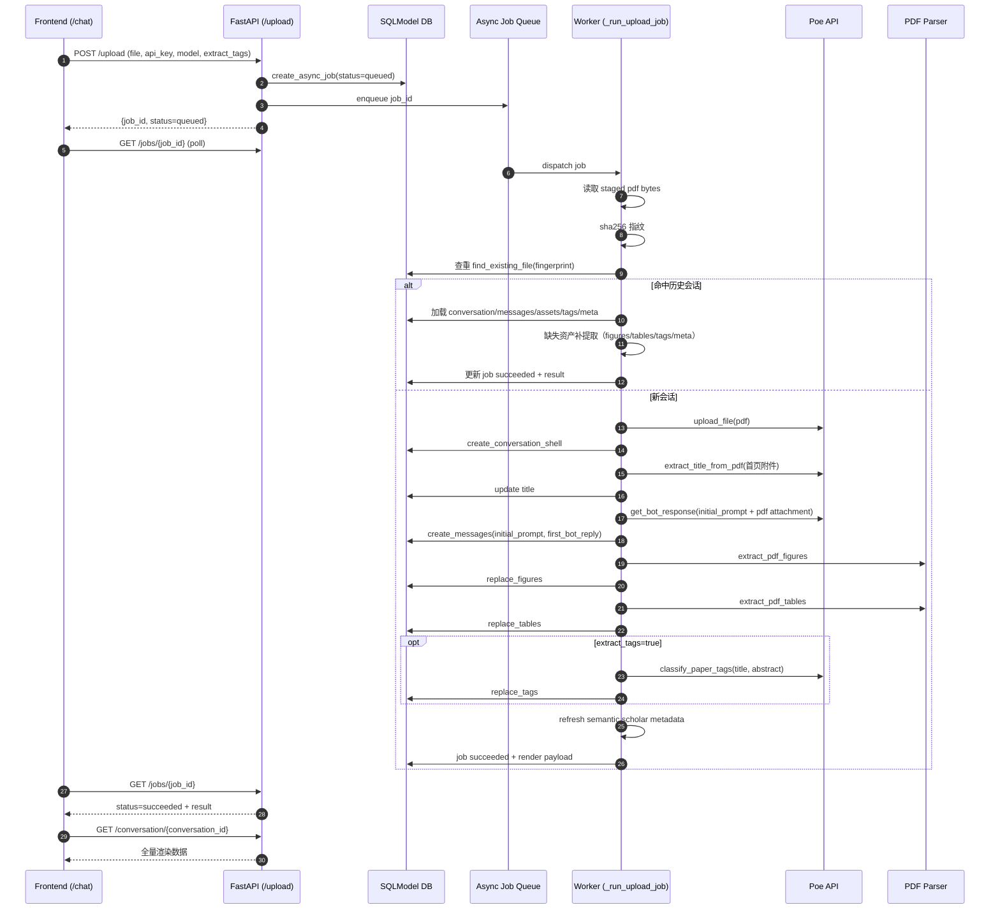
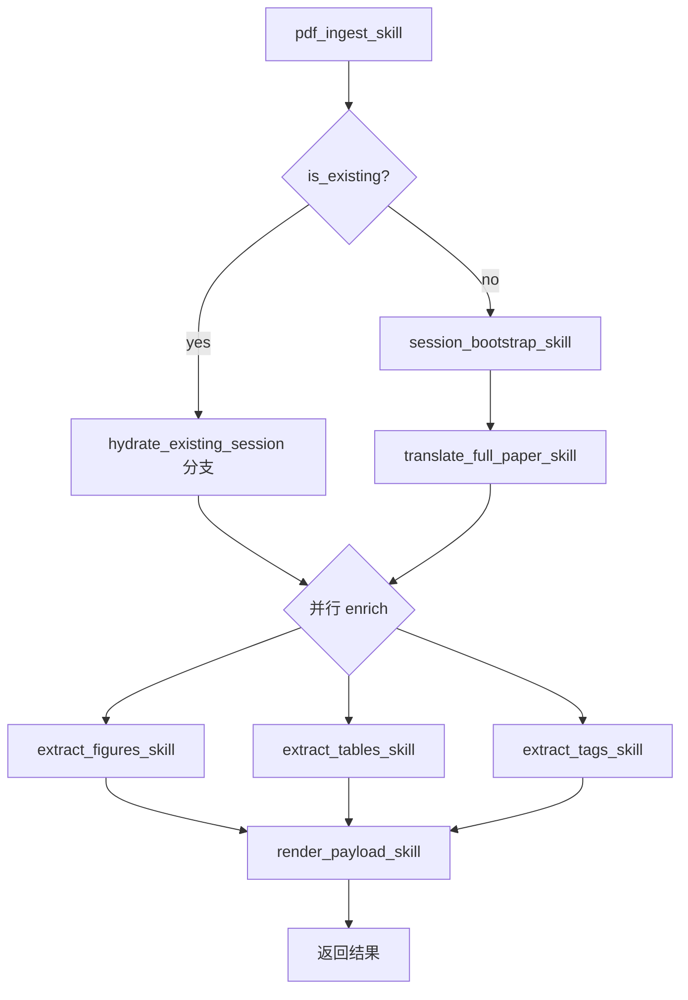

# 单 PDF 流水线 Skill 化与 Agent 串联设计文档（V0）

## 1. Summary

### 1.1 目标
基于现有实现（上传后翻译、继续、标签提取、插图/表格提取、前端渲染），产出一份可直接指导后续工程实现的设计文档，将单个 PDF 的处理流程流水线化，并可拆解为 skill，最终由一个 agent 串联。

### 1.2 采用策略
1. 按能力块拆分 skill，而非函数级拆分。
2. 翻译采用整篇翻译 skill（内部包含首轮翻译和继续循环）。
3. 本阶段仅输出文件级设计草案，不修改后端/前端代码。

### 1.3 代码锚点
- `/Users/icynew/dev/translate/backend/main.py`
- `/Users/icynew/dev/translate/backend/poe_utils.py`
- `/Users/icynew/dev/translate/static/index.html`

---

## 2. As-Is 现状流程映射

### 2.1 上传与首轮处理链路（当前实现）



### 2.2 继续翻译链路（当前实现）
- 前端调用 `POST /continue/{conversation_id}`，后端只负责入队并返回 `job_id`。
- worker 执行 `_run_continue_job`，内部调用 `_continue_conversation`：
  1. 校验会话与文件记录。
  2. 拉取消息历史，首条 user 消息带 PDF attachment 重建 Poe 上下文。
  3. 追加用户消息（默认为“继续”）。
  4. 调用 Poe 生成回复。
  5. 按 `save_to_record` 决定是否落库。
- 前端轮询 `/jobs/{job_id}` 并追加渲染块。

---

## 3. To-Be 目标 Skill Catalog

下述 skill 为“能力块级别”，每个 skill 独立声明输入输出、幂等与重试策略，供 agent 编排。

### 3.1 `pdf_ingest_skill`
- 目的：接收 PDF、校验、读取 bytes、生成指纹、判重。
- `input`: `filename`, `staged_path` 或 `file_bytes`, `api_key`（仅透传）
- `output`: `file_bytes`, `fingerprint`, `is_existing`, `existing_conversation_id?`
- `side_effects`: 无（推荐）
- `idempotency`: 是（同输入同输出）
- `retry_policy`: 可重试（I/O 异常指数退避）

### 3.2 `session_bootstrap_skill`
- 目的：上传 Poe 附件、创建会话壳、提取标题。
- `input`: `file_bytes`, `filename`, `fingerprint`, `title_model`, `api_key`
- `output`: `conversation_id`, `poe_attachment`, `title`, `file_record`
- `side_effects`: 写入 `Conversation`、`FileRecord`
- `idempotency`: 条件幂等（同 fingerprint 应避免重复建会话）
- `retry_policy`: Poe 调用可重试；DB 写入失败回滚

### 3.3 `translate_full_paper_skill`
- 目的：执行“整篇翻译”主流程（首轮 + 继续循环）。
- `input`: `conversation_id`, `poe_attachment`, `poe_model`, `initial_prompt`, `continue_policy`, `api_key`
- `output`: `messages_delta`, `translation_status`, `continue_count_used`
- `side_effects`: 写入 `Message`
- `idempotency`: 非幂等（LLM 输出具随机性）
- `retry_policy`: 请求级重试；写库失败时停止并标记失败

### 3.4 `extract_figures_skill`
- 目的：提取插图并落库。
- `input`: `conversation_id`, `file_bytes`, `preferred_direction?`
- `output`: `figures[]`
- `side_effects`: 覆盖写入 `PaperFigure`
- `idempotency`: 基本幂等（同输入同提取逻辑）
- `retry_policy`: 可重试；异常降级为空或旧结果

### 3.5 `extract_tables_skill`
- 目的：提取表格并落库。
- `input`: `conversation_id`, `file_bytes`, `preferred_direction?`
- `output`: `tables[]`
- `side_effects`: 覆盖写入 `PaperTable`
- `idempotency`: 基本幂等
- `retry_policy`: 可重试；异常降级为空或旧结果

### 3.6 `extract_tags_skill`
- 目的：从首个 bot 消息抽取摘要并分类标签（可开关）。
- `input`: `conversation_id`, `title`, `first_bot_message`, `tag_model`, `enabled`, `api_key`
- `output`: `tags[]`
- `side_effects`: 覆盖写入 `PaperTag`
- `idempotency`: 条件幂等（模型变化会导致不同结果）
- `retry_policy`: 可重试；失败降级为旧标签或空标签

### 3.7 `render_payload_skill`
- 目的：组装前端渲染最小契约 payload。
- `input`: `conversation_id` 或 `PipelineContext`
- `output`: `render_payload`
- `side_effects`: 无
- `idempotency`: 是
- `retry_policy`: 不需要（纯组装）

### 3.8 `refresh_metadata_skill`（可选扩展）
- 目的：刷新 Semantic Scholar/CCF 元数据。
- `input`: `conversation_id`, `title`, `s2_api_key?`
- `output`: `meta`
- `side_effects`: upsert `PaperSemanticScholarResult`
- `idempotency`: 基本幂等（受上游数据变化影响）
- `retry_policy`: 网络重试，失败不阻断主链路

---

## 4. Agent 编排设计

## 4.1 主 agent：`single_pdf_pipeline_agent`

### 编排顺序
1. 串行：`pdf_ingest_skill` → `session_bootstrap_skill` → `translate_full_paper_skill`
2. 并行：`extract_figures_skill` + `extract_tables_skill` + `extract_tags_skill(enabled)`
3. 汇总：`render_payload_skill`
4. 可选：`refresh_metadata_skill`（可并行或后置）

### 编排图



## 4.2 分支：`hydrate_existing_session`
- 触发条件：`pdf_ingest_skill` 判重命中。
- 行为：
  1. 加载历史会话数据。
  2. 按缺失项补执行 `extract_figures_skill` / `extract_tables_skill` / `extract_tags_skill` / `refresh_metadata_skill`。
  3. 统一走 `render_payload_skill` 返回。

## 4.3 失败策略
- 阻断型失败（直接终止并 job failed）：
  - 文件不可读/空文件
  - Poe 附件上传失败（且重试后仍失败）
  - 首轮翻译失败（且重试后仍失败）
  - 关键 DB 写入失败
- 非阻断型失败（返回部分结果 + errors 字段）：
  - 图提取失败
  - 表提取失败
  - 标签提取失败
  - 语义元数据刷新失败

---

## 5. 接口与状态约定

## 5.1 统一上下文对象：`PipelineContext`

```json
{
  "conversation_id": "string",
  "filename": "string",
  "fingerprint": "string",
  "file_bytes": "bytes",
  "poe_attachment": {
    "url": "string",
    "content_type": "string",
    "name": "string"
  },
  "title": "string",
  "messages": [
    {"role": "user|bot", "content": "string"}
  ],
  "assets": {
    "figures": [],
    "tables": []
  },
  "tags": [],
  "meta": {
    "venue_abbr": "string",
    "ccf_category": "A|B|C|None",
    "venue": "string|null",
    "year": "number|null"
  },
  "errors": [
    {
      "skill": "string",
      "type": "string",
      "message": "string",
      "retryable": true
    }
  ]
}
```

## 5.2 Skill I/O 规范
每个 skill 文档必须包含以下字段：
- `input`: 入参定义与必填项
- `output`: 出参定义
- `side_effects`: 数据写入/外部调用
- `idempotency`: 幂等语义
- `retry_policy`: 重试条件、重试次数、退避策略

## 5.3 任务状态与 progress 规范
- 状态集合：`queued` / `running` / `succeeded` / `failed`
- `progress` 文案规范：
  1. 使用短句动宾结构，便于前端直接展示。
  2. 一个阶段一个稳定文案，避免频繁抖动。
  3. 在关键里程碑写入（读文件、判重、上传、提题、首翻、图提取、表提取、标签、完成）。

建议 progress 枚举（可直接复用现有文案）：
- `读取上传文件`
- `计算文件指纹`
- `正在检查是否已存在同指纹会话`
- `上传原始 PDF 到 Poe`
- `调用标题模型提取论文标题`
- `调用翻译模型生成摘要/首章`
- `提取论文插图`
- `提取论文表格`
- `提取论文标签`
- `任务已完成`

---

## 6. 渲染契约（render_payload）

## 6.1 最小字段集合

```json
{
  "conversation_id": "string",
  "title": "string",
  "messages": [
    {"role": "bot", "content": "markdown"}
  ],
  "pdf_url": "string",
  "figures": [
    {
      "id": 0,
      "page_number": 1,
      "figure_index": 1,
      "figure_label": "Figure 1",
      "caption": "...",
      "image_url": "/assets/figures/{id}",
      "image_width": 0,
      "image_height": 0
    }
  ],
  "tables": [
    {
      "id": 0,
      "page_number": 1,
      "table_index": 1,
      "table_label": "Table 1",
      "caption": "...",
      "image_url": "/assets/tables/{id}",
      "image_width": 0,
      "image_height": 0
    }
  ],
  "tags": [
    {
      "tag_code": "T29",
      "tag_label": "机器翻译",
      "category_code": "T",
      "source": "poe|manual"
    }
  ],
  "meta": {
    "venue_abbr": "CVPR",
    "ccf_category": "A",
    "venue": "Conference on ...",
    "year": 2025
  }
}
```

## 6.2 与前端渲染逻辑的对齐点
- `messages[*].content` 为 Markdown，前端继续走 `MathUtils.renderMarkdownWithMath`。
- 目录生成依赖消息内容中的标题结构（h1/h2/h3）。
- 资产区块依赖 `figures[]` 和 `tables[]` 的索引、页码、caption。
- 标签区块依赖 `tags[]` + `meta`（CCF/venue/year）。
- 继续翻译时，前端将新的 bot 块增量追加到 `blocks`。

---

## 7. Test Plan（验证场景与验收标准）

## 7.1 新 PDF 全流程
- 场景：上传未出现过的 PDF，`extract_tags=true`。
- 期望：
  1. job 最终 `succeeded`。
  2. 返回包含首轮翻译、figures、tables、tags、meta。
  3. `/conversation/{id}` 可完整复现返回内容。

## 7.2 重复 PDF 判重
- 场景：上传同一 PDF 两次。
- 期望：
  1. 第二次命中已有会话。
  2. 不重复创建新会话。
  3. 若历史会话缺失图/表/标签，可自动补齐。

## 7.3 继续翻译（整篇翻译 skill 循环）
- 场景：设置 continue 次数 > 1。
- 期望：
  1. 每次 continue 产生一个新增 bot 回复。
  2. 消息顺序正确，前端可连续渲染。

## 7.4 标签开关
- 场景 A：`extract_tags=false` 上传。
- 期望 A：不调用标签分类，`tags` 为空或保持已有。
- 场景 B：`extract_tags=true` 上传。
- 期望 B：调用标签分类并成功写入 `PaperTag`。

## 7.5 图/表提取失败降级
- 场景：模拟图提取或表提取异常。
- 期望：
  1. 主翻译结果仍返回。
  2. `errors` 中记录失败 skill 与原因。
  3. job 不因非阻断错误失败。

## 7.6 渲染契约回归
- 场景：使用 `render_payload` 直接喂给前端页面。
- 期望：
  1. Markdown + 数学公式渲染正常。
  2. 目录、标签、图表区块均可显示。
  3. 无需新增前端适配字段。

---

## 8. Assumptions
- 本阶段仅产出设计文档，不改后端/前端实现。
- 语义元数据刷新作为可选扩展，不阻塞主流水线。
- skill 运行时先复用现有 async job 机制，后续再抽象独立 skill runtime。
- 默认文档落地路径：`/Users/icynew/dev/translate/docs/single-pdf-skill-pipeline.md`。

## 9. Non-Goals（V0）
- 不引入新的编排框架或任务调度中间件。
- 不改动数据库 schema。
- 不变更现有前端交互与 API 协议。
